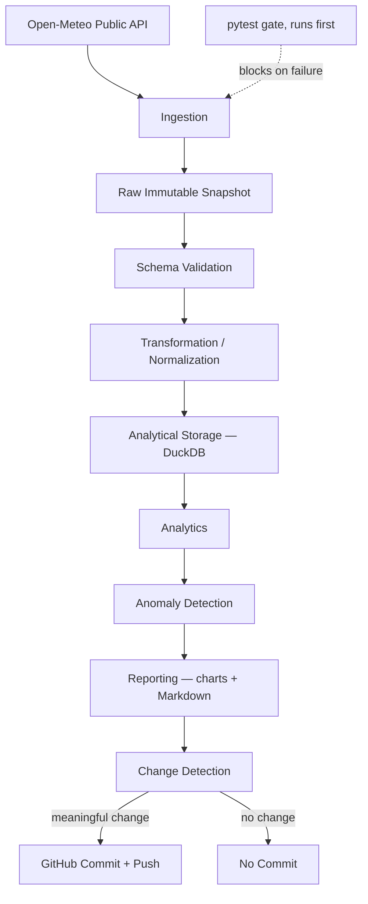

# ADIP — Autonomous Data Intelligence Pipeline

[](https://github.com/OWNER/adip/actions/workflows/tests.yml)
[](https://github.com/OWNER/adip/actions/workflows/pipeline.yml)
[](https://github.com/OWNER/adip/actions/workflows/security.yml)
[](https://www.python.org/)
[](LICENSE)

> Replace `OWNER` above with your GitHub username/org once this repo is pushed — badges only render once the corresponding workflow has run at least once.

A self-operating weather-forecast intelligence platform. ADIP runs on a
schedule via GitHub Actions, ingests live forecast and reanalysis data from
[Open-Meteo](https://open-meteo.com/), stores it as immutable history,
computes real analytics (trends, anomalies, and genuine forecast-accuracy
metrics against observed data), and commits the results back to this
repository — **but only when something meaningful actually changed.**

This is not a "green squares" bot. Read [Automation & Reproducibility](#automation--reproducibility)
below for exactly what that means and how to verify it yourself.

## Table of Contents

- [Why weather forecasting](#why-weather-forecasting)
- [Architecture](#architecture)
- [Features](#features)
- [Tech stack](#tech-stack)
- [Repository structure](#repository-structure)
- [Example analytics](#example-analytics)
- [The intelligent commit system](#the-intelligent-commit-system)
- [GitHub Actions automation](#github-actions-automation)
- [Data-quality methodology](#data-quality-methodology)
- [Testing](#testing)
- [Local setup](#local-setup)
- [Docker setup](#docker-setup)
- [Automation & Reproducibility](#automation--reproducibility)
- [Limitations](#limitations)
- [Future improvements](#future-improvements)
- [Attribution](#attribution)
- [Self-audit](docs/SELF_AUDIT.md)

## Why weather forecasting

Weather forecasting is one of the few public data domains where you can
measure whether predictions were actually *right*, using data anyone can
fetch for free, with no API key. Open-Meteo's forecast API gives predictions;
its separate archive API (ERA5 reanalysis) gives a scientifically credible
approximation of what actually happened, once enough time has passed for
that reanalysis to be finalized. That pairing is what makes this project
more than a scraper: it lets ADIP compute real MAE/RMSE/bias by city and by
forecast lead time, and track how predictions get revised as a target hour
approaches.

## Architecture



Tests run as a separate CI step *before* the pipeline script executes at
all (see `.github/workflows/pipeline.yml`) — a failing suite means the
pipeline never runs that cycle, not just that it doesn't commit.

See [`docs/architecture.md`](docs/architecture.md) for the full breakdown,
including exactly how the DuckDB rebuild-from-raw-JSON design avoids noisy
binary diffs, and a researched explanation of GitHub's contribution-graph
behavior for bot-authored commits.

## Features

- **Live ingestion** from Open-Meteo's forecast API for 16 configurable
  global cities (`configs/cities.yaml`), with retries, exponential backoff,
  timeouts, and strict schema validation — no fabricated data on failure.
- **Forecast-evolution tracking**: every forecast run is stored as an
  immutable snapshot keyed by `(city, forecast_run_ts, target_ts)`, so
  predictions for the same future hour made at different times can be
  compared directly.
- **Real accuracy metrics** (MAE, RMSE, mean bias, precipitation wet/dry
  accuracy) computed only against genuine ERA5 archive data — never
  fabricated ground truth.
- **Robust anomaly detection** using the modified z-score (median/MAD),
  which resists being skewed by the very outliers it's trying to find.
- **Automated, honest data-quality reporting**: null rates, duplicates,
  freshness, row counts, and physical-range checks, written to
  `reports/data_quality/latest.json` and a human-readable Markdown summary.
- **An intelligent commit system**: canonical hashing that strips volatile
  fields, rounds float noise, and normalizes line endings before deciding
  whether a commit is warranted — see below.
- **A real test suite** (pytest, mocked HTTP, no live network calls) that
  gates every automated commit.

## Tech stack

| Layer | Choice | Why |
|---|---|---|
| Language | Python 3.11+ | Type hints, `dataclasses(slots=True)`, modern stdlib |
| HTTP | `requests` | Simple, well-understood retry/timeout semantics |
| Data | `pandas` | Tabular transforms or joins throughout analytics |
| Validation | `pydantic` v2 | Fails fast and loudly on upstream schema drift |
| Storage | `DuckDB` | Embedded, zero-ops, fast analytical SQL; derived not committed |
| Charts | `matplotlib` (Agg backend) | Deterministic, no display server needed in CI |
| Config | `PyYAML` + typed dataclasses | Cities/thresholds are data, not code |
| Tests | `pytest` | Mocked HTTP fixtures, no real network calls in CI |
| Lint/format | `ruff` | Fast, replaces flake8 + black + isort |
| Types | `mypy` | Informational in CI (see Limitations) |
| CI/CD | GitHub Actions | Scheduled pipeline, PR tests, security scans |
| Containerization | Docker | Reproducible local runs, no credentials required |

## Repository structure

```
adip/
├── .github/workflows/{pipeline,tests,security}.yml   # automation
├── .github/dependabot.yml
├── configs/{cities,pipeline}.yaml                     # data-driven config
├── src/adip/
│   ├── ingestion/          # Open-Meteo HTTP client + raw snapshot writer
│   ├── storage/            # DuckDB schema + connection helpers
│   ├── validation/         # Pydantic schemas + data-quality checks
│   ├── transformation/     # raw JSON -> tidy DataFrames
│   ├── analytics/          # descriptive stats, forecast evolution,
│   │                       # accuracy metrics, anomaly detection
│   ├── reporting/          # charts + Markdown report builder
│   └── change_detection.py # the intelligent-commit core
├── scripts/
│   ├── run_pipeline.py     # orchestrator (CLI entrypoint)
│   └── rebuild_db.py       # rebuild DuckDB from committed raw JSON
├── data/raw/               # immutable snapshots (committed)
├── reports/                # latest_report.md, data_quality/, figures/
├── tests/                  # pytest suite + fixtures
├── docs/{architecture,DATA_SOURCES}.md
├── Dockerfile, docker-compose.yml
├── pyproject.toml, Makefile
└── LICENSE
```

## Example analytics

Once the pipeline has run at least once, `reports/latest_report.md`
contains sections generated directly from pipeline output:

```markdown
## Key Metrics
- **current_temperature_distribution_c**: {'count': 16, 'mean': 18.4, ...}

## Major Changes
- **dubai**: +4.2°C (now 39.1°C)
- **reykjavik**: -3.8°C (now 6.2°C)

## Model Results
**Overall** (n=1104): MAE=1.34°C, RMSE=1.79°C, bias=-0.22°C
Precipitation wet/dry accuracy: 0.81 (n=1104)
```

Every number above is traceable to a specific function in
`src/adip/analytics/` — the report builder does no computation of its own,
only formatting (see `src/adip/reporting/report_builder.py`).

## The intelligent commit system

The single most important design constraint in this project: **a scheduled
run that produces no meaningful change must not create a commit.**

`src/adip/change_detection.py` enforces this by canonicalizing every
candidate output file before hashing it:

1. For JSON: parse, strip configured volatile keys (e.g.
   `generationtime_ms`), round every floating-point value to a fixed
   precision, then re-serialize with sorted keys.
2. For Markdown/text: apply the same float-rounding and normalize line
   endings (`\r\n` → `\n`).
3. For binary files (PNG charts): hash raw bytes as-is.
4. Compare the resulting SHA-256 against the hash of the same path's
   content currently committed at `HEAD` (via `git show HEAD:<path>`).

A commit is only recommended if at least one candidate file's canonical
hash differs from what's already committed. `scripts/run_pipeline.py`
exits with code `0` (commit), `1` (no meaningful change — no commit), or
`2` (pipeline failure — no commit); `.github/workflows/pipeline.yml` reads
that exit code and acts accordingly. Running the pipeline twice against
identical upstream data is verified to be a no-op — see
`tests/test_change_detection.py`.

## GitHub Actions automation

Three workflows, each with a distinct, minimal permission scope:

| Workflow | Trigger | Permissions | Purpose |
|---|---|---|---|
| `pipeline.yml` | cron (every 6h) + manual | `contents: write` | Run the pipeline; commit only if meaningful change |
| `tests.yml` | push/PR to `main` | `contents: read` | Lint, type-check, test — blocks merges |
| `security.yml` | push/PR + weekly cron | `contents: read`, `security-events: write` | Dependency audit, secret scan, CodeQL |

**Why each permission is needed, exactly:**
- `pipeline.yml` needs `contents: write` because it is the only workflow
  that pushes commits — nothing else in this repo writes to git.
- `tests.yml` needs only `contents: read` — it validates code, never
  writes anything back.
- `security.yml` needs `contents: read` to check out code, plus
  `security-events: write` solely so CodeQL can upload SARIF results to the
  repository's Security tab — it never modifies repository content.

No workflow uses `permissions: write-all`. Each declares only what it uses,
which is the principle of least privilege in practice.

All three workflows use `concurrency` groups (so overlapping runs cancel
rather than race and corrupt history), `timeout-minutes` (so a hung job
can't burn Actions minutes indefinitely), dependency caching via
`actions/setup-python`'s built-in `cache: pip`, pinned Python versions, and
GitHub Actions job summaries (`GITHUB_STEP_SUMMARY`) for at-a-glance run
status without opening logs.

## Data-quality methodology

Every ingested city's data passes through `src/adip/validation/quality_checks.py`
before it's trusted for analytics:

| Check | What it catches |
|---|---|
| Null fraction | Missing values above a configured threshold |
| Duplicate fraction | Repeated `(city, forecast_run, target_hour)` keys |
| Row count | Suspiciously short responses (partial API failure) |
| Freshness | Data older than `freshness_max_age_hours` |
| Range checks | Physically impossible values (e.g. -300°C, 900% humidity) |

Results are written to `reports/data_quality/latest.json` (machine-readable)
and `reports/data_quality/latest.md` (human-readable), regenerated every
run and only committed if they actually changed.

## Testing

```bash
make test          # full suite with coverage
make lint          # ruff
make typecheck     # mypy (informational — see Limitations)
```

The suite covers: mocked HTTP client behavior (timeouts, retries, rate
limits, malformed JSON, schema drift), transformation correctness
(including forecast-horizon arithmetic), data-quality check logic,
change-detection canonicalization (float noise, volatile keys, line
endings), forecast-accuracy math (MAE/RMSE/bias, precipitation wet/dry
accuracy), anomaly detection (including the small-sample-size guard), and a
static consistency check that every SQL `INSERT`'s placeholder count
matches its table's schema — added specifically after that exact class of
bug was caught during development (see the Limitations section for the
full story). CI runs this suite before the pipeline is allowed to commit
anything.

## Local setup

```bash
git clone https://github.com/OWNER/adip.git
cd adip
make install     # creates .venv, installs -e ".[dev]"
make test        # verify everything works
make pipeline    # run the full pipeline locally (needs internet access)
```

No credentials, API keys, or `.env` file are required — Open-Meteo needs
none. `make rebuild-db` regenerates the DuckDB analytical database purely
from the raw JSON already committed to this repo, so a fresh clone has full
historical analytics available offline immediately.

## Docker setup

```bash
docker build -t adip:latest .
docker run --rm -v $(pwd)/data:/app/data -v $(pwd)/reports:/app/reports adip:latest
# or, equivalently:
docker compose up
```

The container runs as a non-root user, needs no credentials, and writes
its output to the mounted `data/` and `reports/` directories so results are
visible on the host.

## Automation & Reproducibility

Scheduled GitHub Actions executions run the exact same
`scripts/run_pipeline.py` you can run locally — there is no separate "cloud
only" code path. Every run:

1. Rebuilds DuckDB from committed raw JSON (full reproducibility from a
   clean clone).
2. Fetches live data from Open-Meteo.
3. Runs the test suite; a failing suite blocks any commit.
4. Computes analytics and writes reports/charts.
5. Runs change detection; **commits only if canonical content actually
   differs from what's already in git.**

**What this project deliberately never does:** create empty commits, touch
files purely to generate contribution activity, fabricate data when the API
fails, manufacture fake issues/PRs/contributors, or rewrite git history.
When a scheduled run finds nothing meaningful changed, the Actions log
says exactly that — "No meaningful data change detected — repository
unchanged" — and no commit happens. That's not a fallback path; it's the
expected, common outcome, and you should expect to see it in most runs.

See [`docs/architecture.md`](docs/architecture.md) for a detailed,
researched explanation of how GitHub's contribution graph treats
bot-authored commits (short version: commits pushed under the
`GITHUB_TOKEN`-based `adip-bot` identity used here are real and visible in
this repo's history, but will not appear on any personal contribution
graph, because that identity isn't linked to a GitHub account — and this
project does not attempt to work around that).

## Limitations

- **Dependency installation wasn't verified with live network access
  during development** of this repository (the authoring environment had
  no outbound network access to PyPI). Every file was syntax-checked
  (`py_compile`), and all logic that only needs `pandas`/`numpy`/stdlib was
  executed and verified directly (change detection canonicalization,
  descriptive statistics, anomaly detection, accuracy metrics, forecast
  evolution). Logic depending on `pydantic`/`duckdb`/`pytest` was verified
  by careful manual trace-through rather than execution. **Run `make
  install && make test` as the first step after cloning** — CI (`tests.yml`)
  does this automatically on every push and PR, so any remaining issue
  will surface there before it reaches the scheduled pipeline.
- During that manual review, **two real bugs were found and fixed** this
  way: a `.rolling(on=...)` misalignment across pandas versions returning
  all-NaN rolling averages, and two SQL `INSERT` statements with fewer
  placeholders than their target table's column count (which would have
  raised a runtime error the first time archive/current-conditions data was
  ever written). Both are covered by regression tests now
  (`test_rolling_average_correct_per_group_alignment`,
  `test_insert_placeholder_counts_match_schema`).
- Forecast accuracy can only be scored for target hours old enough that
  the ERA5 archive has finalized (`archive.min_days_lag`, currently 5 days)
  — very recent forecasts are correctly excluded rather than scored
  against incomplete data.
- Chart PNG byte-for-byte reproducibility across matplotlib versions isn't
  guaranteed; a matplotlib upgrade could cause a one-time chart diff with
  no underlying data change. Accepted as a documented tradeoff.
- `mypy` runs in CI as informational (`continue-on-error: true`) rather
  than a hard gate, since full strict typing over pandas DataFrame flows
  has a poor effort-to-value ratio at this project's size.
- DuckDB rebuild time grows linearly with committed raw JSON file count;
  fine at current scale (~16 cities, every 6h) for years of history, but
  incremental rebuild is the natural next step if that changes.

## Future improvements

- Incremental DuckDB rebuild (only replay raw files newer than last build).
- A precipitation-amount metric (not just wet/dry classification) once
  enough archive history accumulates to make it statistically meaningful.
- Multi-model comparison (Open-Meteo supports selecting specific
  weather models) once a clear use case for it emerges.
- A lightweight, honestly-scoped baseline ML model (e.g. persistence vs.
  simple regression for next-day temperature) with an explicit train/test
  split and reported limitations, if it can be justified data-wise.

## Attribution

Weather data is provided by [Open-Meteo](https://open-meteo.com/) under
its [open data license](https://open-meteo.com/en/license). ADIP does not
claim ownership of the underlying weather data — only of the pipeline code
and the derived analytics it computes. See
[`docs/DATA_SOURCES.md`](docs/DATA_SOURCES.md) for full provenance details.
