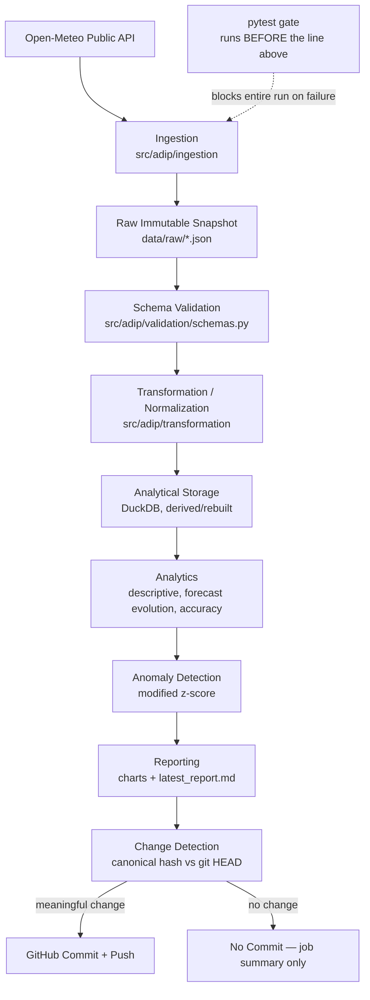

# ADIP Architecture

## Pipeline flow

This mirrors `scripts/run_pipeline.py` almost exactly: each box in the main
chain corresponds to a concrete function call in that file, in the same
order. **One deliberate difference from a naive reading of the brief:**
tests are not a step *inside* `run_pipeline.py` — they run as a separate,
earlier step in `.github/workflows/pipeline.yml` ("Run test suite"), before
`scripts/run_pipeline.py` is even invoked. This is stricter than running
tests after reporting: a failing test suite means the pipeline script never
runs at all that cycle, so no partially-computed report or chart can ever
be generated, let alone committed. `tests.yml` runs the same suite again,
independently, on every push/PR to `main`.

## Why DuckDB is not committed to git

DuckDB is used as the analytical engine because it makes forecast-evolution
and accuracy SQL fast and simple. But the `.duckdb` file is a binary blob
that would change on every single run regardless of whether the *meaning*
of the data changed — exactly the kind of noisy diff this project's design
brief explicitly forbids. Instead:

- `data/raw/**/*.json` (forecast snapshots) and `data/raw/archive/**/*.json`
  (archive/observed snapshots) are the source of truth and are committed.
- `scripts/rebuild_db.py` deterministically reconstructs the full DuckDB
  database from that raw history. It runs automatically at the start of
  every pipeline execution and is available standalone via `make rebuild-db`.
- This makes the project fully reproducible from a clean clone with no
  hidden state.

## The intelligent commit system

`src/adip/change_detection.py` is the layer that decides whether a pipeline
run's output is worth a commit. For every candidate output file (reports,
data-quality JSON/MD, chart PNGs, new raw JSON snapshots):

1. Canonicalize the file: for JSON/Markdown, parse, strip configured
   volatile keys (e.g. `generationtime_ms`), round floating-point values to
   a fixed precision (to ignore representation noise), and normalize line
   endings. Binary files (PNGs) are hashed by raw bytes.
2. Hash the canonical form (SHA-256).
3. Compare against the canonical hash of the same path's content currently
   committed at `HEAD` (via `git show HEAD:<path>`), if it exists.
4. A file is "changed" only if the canonical hashes differ. A brand-new
   file (not yet in git) always counts as changed.

The orchestrator only recommends a commit (`exit code 0`) if at least one
candidate file changed; the GitHub Actions workflow is the thing that
actually runs `git commit`/`git push`, and only when that exit code says to.

## GitHub contribution graph behavior (researched, not assumed)

GitHub's contribution graph counts a commit toward the *contributor's*
graph only when:

- The commit's author email is associated with the GitHub account whose
  graph you're looking at, **and**
- The commit was made in the default branch of a non-fork repository (or a
  repo the account has been explicitly granted access to as a
  contributor).

Commits pushed by the built-in `GITHUB_TOKEN` (as `pipeline.yml` does here,
under the identity `adip-bot <adip-bot@users.noreply.github.com>`) are real,
verifiable, signed-off commits in the repository's history — but because
that author identity is **not linked to any GitHub user account**, GitHub
will **not** count them on any personal contribution graph. This is
intentional and disclosed here rather than worked around: attempting to
make automated commits "count" by re-authoring them as the repository
owner would misrepresent authorship of machine-generated work, which this
project's design brief explicitly prohibits.

**How the repository owner can verify real activity instead of relying on
the contribution graph:**

- The commit history itself (`git log --author=adip-bot`) shows every
  automated run that produced a meaningful change, with descriptive
  conventional-commit messages.
- The Actions tab shows every scheduled run, including the (majority of)
  runs that correctly made **no commit** because nothing meaningful changed
  — this is the real signal of the system working as designed, not a
  contribution square.
- `reports/latest_report.md`'s "Pipeline Run Information" section and the
  GitHub Actions job summary (visible per-run in the Actions tab) both show
  concrete execution stats (records ingested, anomalies found, whether a
  commit happened) for every run, successful or not.

If a reviewer wants automated commits to appear on a personal contribution
graph, the correct (and only legitimate) mechanism is for the repository
owner to configure the workflow to commit using their own account via a
personal access token instead of `GITHUB_TOKEN`. ADIP does not do this by
default, to keep automated and human authorship visibly distinct.

## Known limitations

- Chart PNG byte-for-byte reproducibility is not guaranteed across
  matplotlib versions; a matplotlib upgrade could cause a one-time
  "spurious" chart diff even with unchanged underlying data. This is
  accepted as a documented tradeoff rather than solved with perceptual
  image hashing, to keep the system's dependency footprint small.
- Forecast accuracy scoring is only possible for target hours old enough
  that the ERA5 archive has finalized (`archive.min_days_lag`, currently 5
  days) — very recent forecasts are correctly excluded from accuracy
  metrics rather than scored against incomplete data.
- DuckDB rebuild time grows linearly with the number of committed raw JSON
  files. At the project's current scale (~16 cities, every 6 hours) this
  remains fast (well under a minute) for at least several years of history;
  if it becomes a bottleneck, incremental rebuild (only replaying files
  newer than the last rebuild) is the natural next step.
